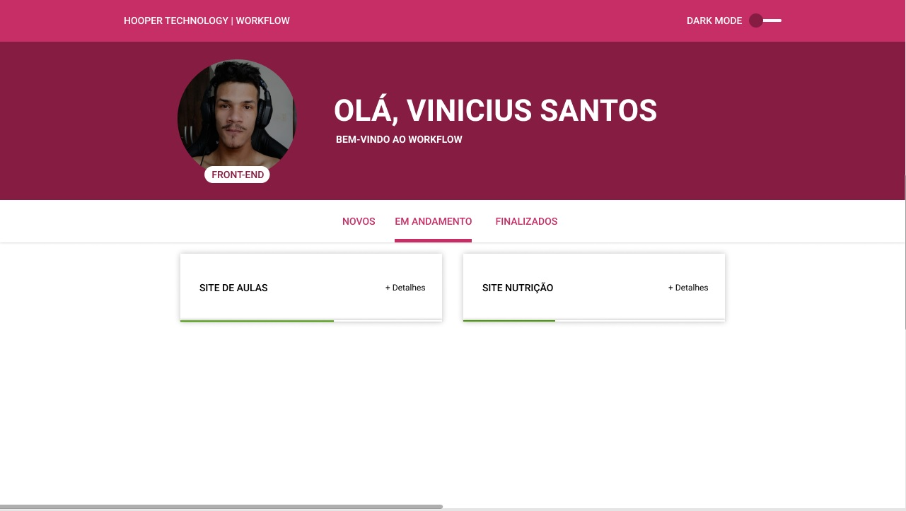

# Hooper Technology | WorkFlow

O WorkFlow é um projeto que foi pensado no intuito de organizar todos os trabalhos da empresa de forma simplificada e também para o aprendizado de: **TypeScript** e **Styled Component**.

# Telas

- Home

	> Na tela inicial nós temos 4 componentes que são:
	> - Header
	> - User
	> - Navigation
	> - CardProject
	
**Header**
  _IMAGEM AQUI_
  
**User**
  _IMAGEM AQUI_
  
**Navigation**
  _IMAGEM AQUI_
  
**CardProject**
  _IMAGEM AQUI_
